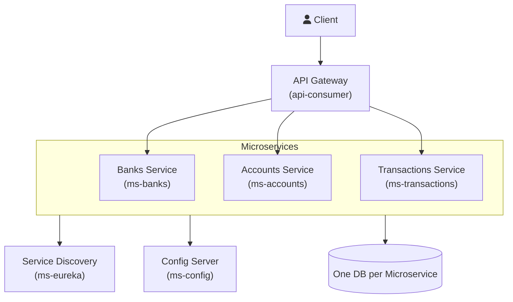

# Santander Challenge: Microservicio de Entidades Bancarias

Este proyecto presenta la solución al ejercicio práctico 1, enfocado en el desarrollo de un microservicio bajo una arquitectura REST que gestiona entidades bancarias, cumpliendo con los requisitos de funcionalidad (CRUD completo, EndPoint de llamada interna) y aspectos de diseño y robustez (manejo de excepciones y duplicidad).

## 1. Enunciado del Ejercicio Práctico 1

**Objetivo Principal:**

Desarrollar un microservicio, arquitectura REST, que exponga un CRUD completo sobre **entidades bancarias**, es decir, el CRUD debe permitir Altas, bajas, modificaciones, y consultas. Los campos de la entidad son a libre a interpretación al igual que sus relaciones (puede tener o no).

Asimismo, se espera que el microservicio exponga un nuevo End Point (dentro del mismo microservicio) que consuma el end point de consulta, es decir, que realice una llamada así mismo.

**Aspectos a Valorar (Key Focus Areas):**

- Se puede usar una base de datos en memoria (**H2**).
- Se valora el diseño del microservicio: tipo de **arquitectura**, si aplica algún **patrón de diseño**, etc.
- Se valoran aspectos tales como manejo de **duplicidad** en la creación/POST y en el manejo de **excepciones**.
- Se valora si el ejemplo incorpora algún **test**.

## 2. Propuesta de Arquitectura de Microservicios

Para demostrar un diseño escalable y robusto, el proyecto se enmarca dentro de una arquitectura de microservicios más amplia, utilizando Spring Cloud para los componentes de soporte.

El servicio central desarrollado (`ms-banks`) forma parte de este ecosistema.

### 2.1. Diagrama Arquitectónico

La siguiente gráfica representa la arquitectura completa del sistema de microservicios propuesto:



### 2.2. Arquitectura Hexagonal (Ports & Adapters)

El proyecto implementa **Arquitectura Hexagonal** para mantener la separación de responsabilidades y facilitar el testing y mantenimiento.

**Estructura de Paquetes:**

```text
ms-banks/ (o ms-accounts/)
└── src/main/java/com/santander/challenge/ms_banks/
    ├── domain/                    # Capa de Dominio (Núcleo)
    │   ├── model/                 # Entidades de dominio
    │   ├── port/
    │   │   ├── input/             # Puertos de entrada (casos de uso)
    │   │   └── output/            # Puertos de salida (repositorios)
    │   └── exception/             # Excepciones de dominio
    │
    ├── application/               # Capa de Aplicación (Casos de Uso)
    │   ├── service/               # Implementación de servicios
    │   └── mapper/                # DTO ↔ Domain
    │
    ├── adapter/                   # Capa de Adaptadores
    │   ├── input/                 # Adaptadores de entrada (REST, Feign)
    │   └── output/                # Adaptadores de salida (JPA, HTTP)
    │
    └── config/                    # Configuración
```

## 3. Modelo de Datos

### 3.1. Entidad Bank (ms-banks)

| Atributo    | Tipo          | Descripción                   |
| ----------- | ------------- | ----------------------------- |
| `id`        | UUID          | Identificador único           |
| `code`      | String        | Código único del banco        |
| `name`      | String        | Nombre del banco              |
| `country`   | String        | País donde opera              |
| `address`   | String        | Dirección principal           |
| `phone`     | String        | Teléfono de contacto          |
| `email`     | String        | Email de contacto             |
| `createdAt` | LocalDateTime | Fecha de creación             |
| `updatedAt` | LocalDateTime | Fecha de última actualización |

**Reglas de Negocio:**

- El `code` debe ser único (manejo de duplicidad)
- No se puede eliminar un banco que tenga cuentas asociadas

### 3.2. Entidad Account (ms-accounts)

| Atributo            | Tipo          | Descripción                                  |
| ------------------- | ------------- | -------------------------------------------- |
| `id`                | UUID          | Identificador único                          |
| `accountNumber`     | String        | Número de cuenta único                       |
| `bankId`            | UUID          | ID del banco al que pertenece                |
| `accountHolderName` | String        | Nombre del titular                           |
| `accountType`       | Enum          | Tipo de cuenta (CHECKING, SAVINGS, BUSINESS) |
| `balance`           | BigDecimal    | Saldo actual                                 |
| `currency`          | String        | Moneda (ISO 4217)                            |
| `status`            | Enum          | Estado (ACTIVE, INACTIVE, BLOCKED)           |
| `createdAt`         | LocalDateTime | Fecha de creación                            |
| `updatedAt`         | LocalDateTime | Fecha de última actualización                |

**Reglas de Negocio:**

- El `accountNumber` debe ser único
- El `bankId` debe existir en ms-banks (validación mediante HTTP)
- Aislamiento de datos: un banco solo puede acceder a sus propias cuentas

## 4. Endpoints Principales

### 4.1. ms-banks

- `POST /api/banks` - Crear banco
- `GET /api/banks/{id}` - Obtener banco por ID
- `GET /api/banks` - Listar bancos (con paginación y filtro por país)
- `PUT /api/banks/{id}` - Actualizar banco
- `DELETE /api/banks/{id}` - Eliminar banco
- `GET /api/banks/{id}/internal` - Endpoint interno (llamada a sí mismo mediante Feign)

### 4.2. ms-accounts

- `POST /api/accounts` - Crear cuenta
- `GET /api/accounts/{id}?bankId={bankId}` - Obtener cuenta por ID
- `GET /api/accounts?bankId={bankId}` - Listar cuentas de un banco (con paginación)
- `PUT /api/accounts/{id}?bankId={bankId}` - Actualizar cuenta
- `DELETE /api/accounts/{id}?bankId={bankId}` - Eliminar cuenta
- `GET /api/accounts/count?bankId={bankId}` - Contar cuentas de un banco

## 5. Comunicación entre Microservicios

El proyecto utiliza **HTTP Síncrono** mediante **Feign Client** para la comunicación entre microservicios:

- **ms-accounts → ms-banks**: Valida que un `bankId` existe antes de crear/actualizar una cuenta
- **ms-banks → ms-accounts**: Valida que un banco no tiene cuentas antes de eliminarlo

La implementación utiliza **Arquitectura Hexagonal** con puertos y adaptadores, facilitando futuras migraciones a colas de mensajes sin modificar la lógica de negocio.

## 6. Manejo de Errores

El proyecto utiliza códigos de error descriptivos en lugar de códigos numéricos genéricos.

**Códigos de Error principales:**

- `BANK_NOT_FOUND` / `ACCOUNT_NOT_FOUND` - Recurso no encontrado (404)
- `DUPLICATE_BANK_CODE` / `DUPLICATE_ACCOUNT_NUMBER` - Duplicidad (409)
- `BANK_HAS_ACCOUNTS` - No se puede eliminar banco con cuentas (409)
- `BANK_VALIDATION_ERROR` / `ACCOUNT_VALIDATION_ERROR` - Error de validación (400)
- `UNAUTHORIZED_ACCESS` - Acceso no autorizado (403)
- `INTERNAL_SERVER_ERROR` - Error interno (500)

**Formato de respuesta de error:**

```json
{
  "timestamp": "2025-12-04T07:10:38.910620143",
  "status": 404,
  "error": "Not Found",
  "code": "BANK_NOT_FOUND",
  "message": "Bank with id 36736800-0ef0-4c0b-9bb0-8746a1d11f64 not found",
  "path": "/api/accounts"
}
```

## 7. Ejecución del Proyecto

### 7.1. Requisitos Previos

- Java 17 o superior
- Maven 3.6+
- Docker y Docker Compose (opcional)
- PostgreSQL (si no se usa Docker)

### 7.2. Ejecución Local

Opción 1: Script de Inicio

```bash
./scripts/run-start.sh
```

Este script inicia todos los servicios en el orden correcto:

1. ms-eureka (Service Discovery) - Puerto 8761
2. ms-config (Config Server) - Puerto 8888
3. ms-banks - Puerto 8090
4. ms-accounts - Puerto 9090
5. api-consumer (API Gateway) - Puerto 8080

Opción 2: Docker Compose

```bash
docker-compose up -d
```

### 7.3. Bases de Datos

Cada microservicio tiene su propia base de datos PostgreSQL:

- **ms-banks**: `localhost:5432/ms_banks_db`
- **ms-accounts**: `localhost:5434/ms_accounts_db`

**Credenciales**: Usuario `root`, Contraseña `root`

### 7.4. Documentación API

**Swagger UI:**

- ms-banks: `http://localhost:8090/swagger-ui/index.html`
- ms-accounts: `http://localhost:9090/swagger-ui/index.html`
- A través del API Gateway: `http://localhost:8080/api/banks/swagger-ui/index.html` y `http://localhost:8080/api/accounts/swagger-ui/index.html`

**Postman Collection:** Se incluye `Santander-Challenge.postman_collection.json` con todos los endpoints configurados.

## 8. Tecnologías Utilizadas

- **Java 17**
- **Spring Boot 3.x**
- **Spring Cloud** (Gateway, Config, Eureka, OpenFeign)
- **Spring Data JPA**
- **PostgreSQL**
- **Lombok** (reducción de boilerplate)
- **SpringDoc OpenAPI** (Swagger)
- **Maven** (gestión de dependencias)
- **Docker** (contenedores)
