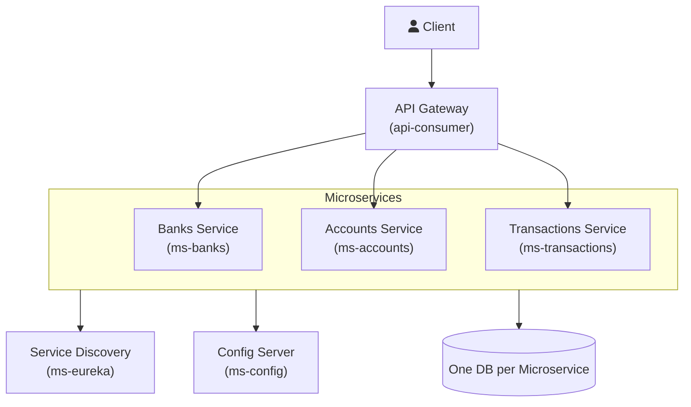

# Santander Challenge: Microservicio de Entidades Bancarias

Este proyecto presenta la solución al ejercicio práctico 1, enfocado en el desarrollo de un microservicio bajo una arquitectura REST que gestiona entidades bancarias, cumpliendo con los requisitos de funcionalidad (CRUD completo, EndPoint de llamada interna) y aspectos de diseño y robustez (manejo de excepciones y duplicidad).

## 1. Enunciado del Ejercicio Práctico 1

**Objetivo Principal:**

Desarrollar un microservicio, arquitectura REST, que exponga un CRUD completo sobre **entidades bancarias**, es decir, el CRUD debe permitir Altas, bajas, modificaciones, y consultas. Los campos de la entidad son a libre a interpretación al igual que sus relaciones (puede tener o no).

Asimismo, se espera que el microservicio exponga un nuevo End Point (dentro del mismo microservicio) que consuma el end point de consulta, es decir, que realice una llamada así mismo.

**Aspectos a Valorar (Key Focus Areas):**

* Se puede usar una base de datos en memoria (**H2**).
* Se valora el diseño del microservicio: tipo de **arquitectura**, si aplica algún **patrón de diseño**, etc.
* Se valoran aspectos tales como manejo de **duplicidad** en la creación/POST y en el manejo de **excepciones**.
* Se valora si el ejemplo incorpora algún **test**.

## 2. Propuesta de Arquitectura de Microservicios

Para demostrar un diseño escalable y robusto, el proyecto se enmarca dentro de una arquitectura de microservicios más amplia, utilizando Spring Cloud para los componentes de soporte.

El servicio central desarrollado (`ms-banks`) forma parte de este ecosistema.

### 2.1. Diagrama Arquitectónico

La siguiente gráfica representa la arquitectura completa del sistema de microservicios propuesto:

